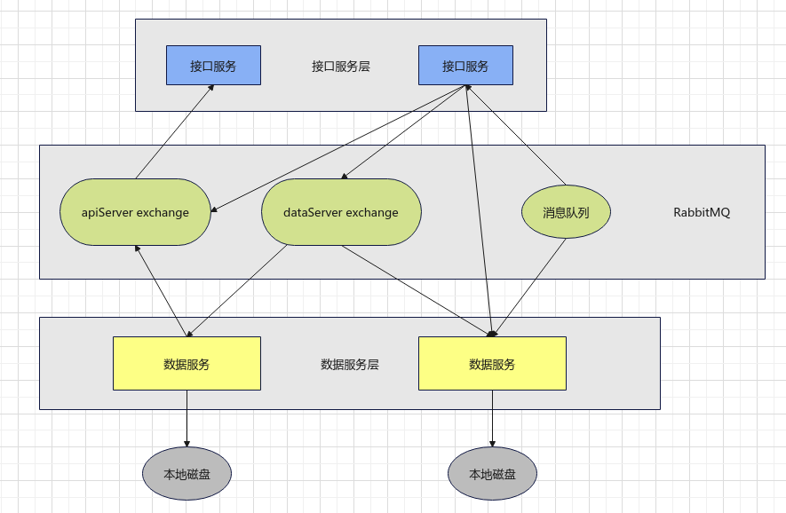

# 可扩展 分布式系统

一个分布式系统要求各节点分布在网络上，通过**消息传递**来合作完成一个共同目标，分布式系统的三大关键特征是: 节点之间**并发**工作; 没有全局锁以及某个节点上发生的错误不影响其他节点; 只要加入新的节点就可以自由**扩展**集群的性能。相比单机的对象存储，下面要将接口和数据类型解耦合，让接口和数据存储成为相互独立的服务节点，两者互相合作提供对象存储服务。

:up: 架构图

- 接口服务层对外提供REST接口；
- 数据服务层提供数据的存储服务；

> 接口服务和数据服务之间的接口有两种，一种是实现对象的存取，使用REST接口，此时接口服务节点作为HTTP客户端向数据服务请求对象；还有一种接口通过RabbitMQ消息队列进行通信，这里对RabbitMQ的使用分为两种模式，一种模式是向某个exchange进行一对多的消息群发，另一种模式是向某个消息队列进行一对一的消息单发。
